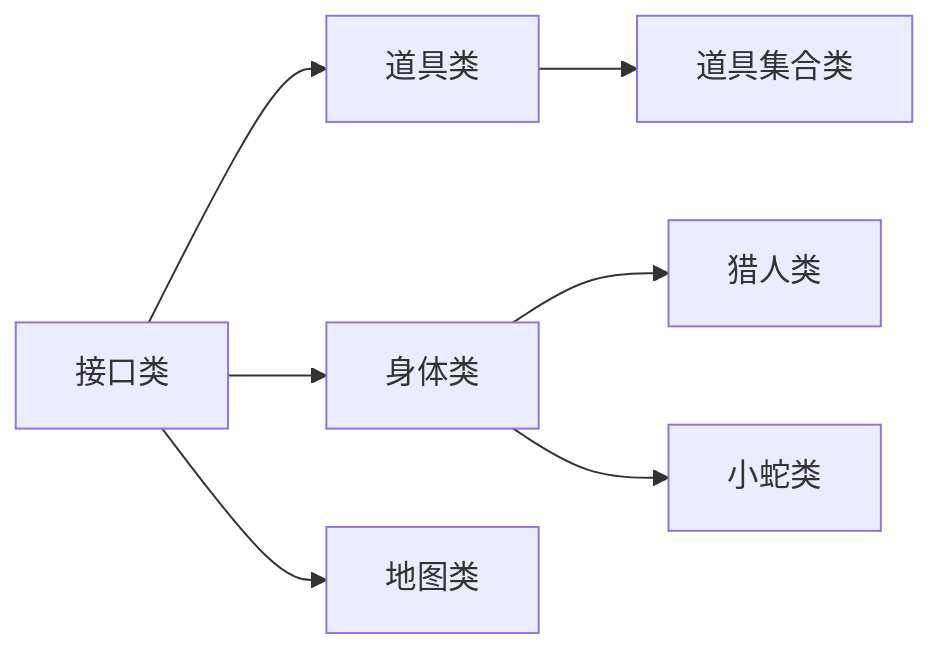

# CShape_Project
c#贪吃蛇项目，利用windows平台开发，基于.net 3.0，vs2019

```mermaid 
graph LR  
A[接口类]  
B[道具类]
C[身体类]
D[地图类]  
E[道具集合类]  
F[猎人类]  
G[小蛇类]  
A-->B
A-->C
A-->D
B-->E
C-->F
C-->G
```

以下是每个方法与属性  
| 道具集合类 | 猎人类 | 小蛇类 |  
| --------- | ------ | ----- |  
| 产生道具 | 判断位置 | 略 |  
| 。。。。略。。。。。。|  

